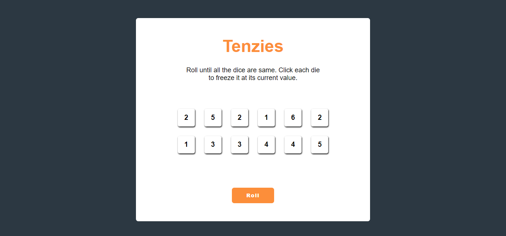

# Tenzies Game
 
## Table of Content

 * [Overview of the Project](#overview-of-the-project)
 * [Challenges](#challenges)
      * [Screenshot](#screenshot)
 * [Technologies I Used](#technologies-i-used)
 * [What I Learned](#what-i-learned)

# Overview of the Project
The famous tenzies game made with React.

## Challenges
* The project contains 12 dice and a roll button. When you click the roll button random numbers from 1-6 appear on each die. You have to roll the dice till all dice consist of the same value. 

  I have added a count feature to the game so it tells you how many turns it took to win the game. Also added a confetti package when the game ends.

## Screenshot

## Technologies I Used

* React

## What I Learned
* Learned about useState.
* Learned about use effect.
* Learned how to use nanoid to provide a different ID to each die.
